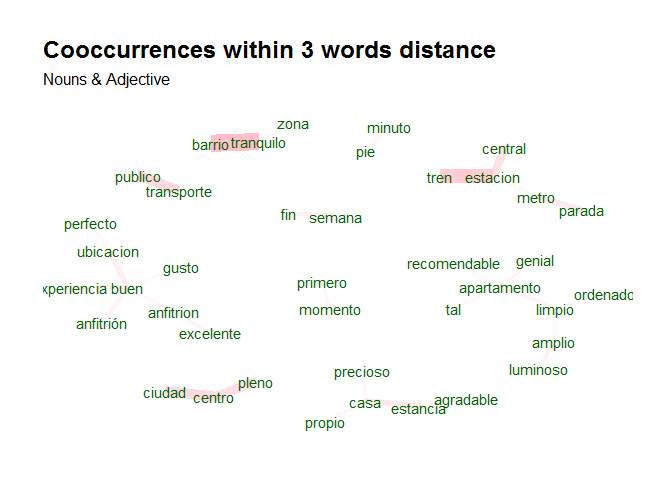
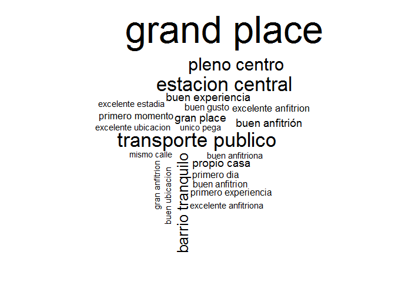
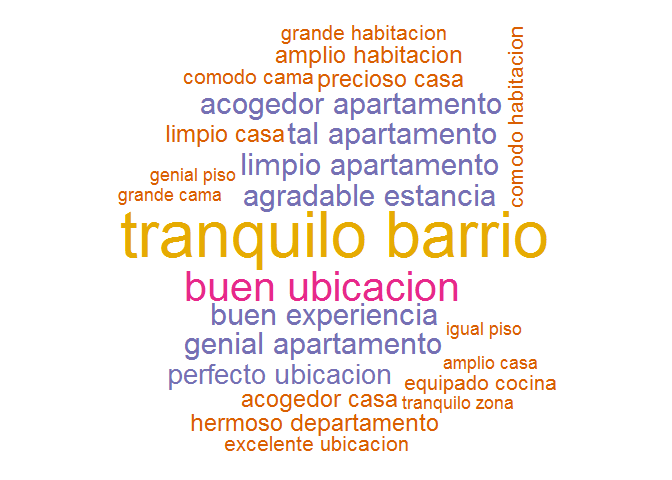

udpipe demo - Jan Wijffels
==========================

-   The **[udpipe R package](https://CRAN.R-project.org/package=udpipe)** is a wrapper around the **[UDPipe C++ library](https://github.com/ufal/udpipe)** and allows to do **Tokenisation, Lemmatisation, Parts of Speech tagging, morphological feature tagging and Dependency Parsing**
-   Models are available for more than 50 languages. These are built on the data from <http://universaldependencies.org>
-   Docs at <https://github.com/bnosac/udpipe>, <https://bnosac.github.io/udpipe/en>,
-   The R package allows to do the following
    -   Annotation (tokenisation, lemma's, POS & Morphology tagging, Dependency Parsing)
    -   Build a new annotation model based on CONLL-U data from R or easily download an existing model (&gt;50 languages)
    -   Keyword identification
    -   Basic NLP flows & standard use cases of NLP
-   Example based on Customer Feedback on AirBnB apartments in Brussels (<http://insideairbnb.com/get-the-data.html>)

Install R packages from CRAN
----------------------------

``` r
install.packages(pkgs = c("udpipe", "textrank", "wordcloud"))
```

Show data
---------

``` r
library(udpipe)
library(textrank)
library(wordcloud)
data(brussels_reviews, package = "udpipe")
comments <- subset(brussels_reviews, language %in% "es")
head(comments, n = 1)
#>         id listing_id
#> 1 32198807    1291276
#>                                                                                                                                                                                                                                                                                                                                                                                                                                                                                                                                                                                           feedback
#> 1 Gwen fue una magnifica anfitriona. El motivo de mi viaje a Bruselas era la busqueda de un apartamento y Gwen me ayudo en todo momento tanto para las paginas en las que debia buscar como en las zonas que me aconsejaba. Ademas es muy simpatica y agradable. Me dejo utilizar su Ipad para hacer skype con mis padres asi como utilizar su ordenador para buscar apartamentos. El ultimo dia, ademas, me acompano a la estacion de trenes con su coche ya que iba con dos maletas grandes. Por supuesto, la casa es como aparece en las fotos. En definitiva un sitio mas que recomendable!!!!
#>   language
#> 1       es
```

Annotate
--------

This downloads the Spanish model and does tokenisation, lemmatisation, parts of speech tagging, morphological feature extraction and dependency parsing.

``` r
## Download + load the model
udmodel <- udpipe_download_model(language = "spanish")
#> Downloading udpipe model from https://raw.githubusercontent.com/jwijffels/udpipe.models.ud.2.0/master/inst/udpipe-ud-2.0-170801/spanish-ud-2.0-170801.udpipe to C:/Users/Jan/Dropbox/Work/RForgeBNOSAC/OpenSource/textworkshop18/demos/udpipeDemo/spanish-ud-2.0-170801.udpipe
udmodel <- udpipe_load_model(udmodel$file_model)
## Annotate - might take +/- 3 minutes
x <- udpipe_annotate(udmodel, x = comments$feedback, doc_id = comments$id, trace = 100) 
#> 2018-04-09 14:36:59 Annotating text fragment 1/500
#> 2018-04-09 14:37:33 Annotating text fragment 101/500
#> 2018-04-09 14:38:04 Annotating text fragment 201/500
#> 2018-04-09 14:38:33 Annotating text fragment 301/500
#> 2018-04-09 14:39:06 Annotating text fragment 401/500
x <- as.data.frame(x)
head(x, 3)
#>     doc_id paragraph_id sentence_id                           sentence
#> 1 32198807            1           1 Gwen fue una magnifica anfitriona.
#> 2 32198807            1           1 Gwen fue una magnifica anfitriona.
#> 3 32198807            1           1 Gwen fue una magnifica anfitriona.
#>   token_id token lemma  upos xpos
#> 1        1  Gwen  Gwen PROPN <NA>
#> 2        2   fue   ser  VERB <NA>
#> 3        3   una   uno   DET <NA>
#>                                                   feats head_token_id
#> 1                                                  <NA>             5
#> 2 Mood=Ind|Number=Sing|Person=3|Tense=Past|VerbForm=Fin             5
#> 3      Definite=Ind|Gender=Fem|Number=Sing|PronType=Art             5
#>   dep_rel deps misc
#> 1   nsubj <NA> <NA>
#> 2     cop <NA> <NA>
#> 3     det <NA> <NA>
```

Find keywords
-------------

### Find keywords by doing Parts of Speech tagging in order to identify nouns

``` r
stats <- subset(x, upos %in% c("NOUN")) 
stats <- txt_freq(stats$token)
head(stats)
#>           key freq freq_pct
#> 1 apartamento  302 4.600853
#> 2        casa  276 4.204753
#> 3      centro  166 2.528946
#> 4     minutos  109 1.660573
#> 5    estancia  103 1.569165
#> 6      ciudad   99 1.508227
```

### Find keywords based on Collocations and Co-occurrences

``` r
## Collocation (words following one another)
stats <- keywords_collocation(x = x, 
                             term = "token", group = c("doc_id", "paragraph_id", "sentence_id"),
                             ngram_max = 4)
## Co-occurrences: How frequent do words occur in the same sentence, in this case only nouns or adjectives
stats <- cooccurrence(x = subset(x, upos %in% c("NOUN", "ADJ")), 
                     term = "lemma", group = c("doc_id", "paragraph_id", "sentence_id"))
## Co-occurrences: How frequent do words follow one another
stats <- cooccurrence(x = x$lemma, 
                     relevant = x$upos %in% c("NOUN", "ADJ"))
## Co-occurrences: How frequent do words follow one another even if we would skip 2 words in between
stats <- cooccurrence(x = x$lemma, 
                     relevant = x$upos %in% c("NOUN", "ADJ"), skipgram = 2)
head(stats)
#>        term1     term2 cooc
#> 1     barrio tranquilo   36
#> 2   estacion      tren   30
#> 3 transporte   publico   23
#> 4     centro    ciudad   23
#> 5      pleno    centro   20
#> 6   estacion   central   19
```

``` r
## Network visualisation - optional
library(igraph)
library(ggraph)
library(ggplot2)
wordnetwork <- head(stats, 30)
wordnetwork <- graph_from_data_frame(wordnetwork)
ggraph(wordnetwork, layout = "fr") +
  geom_edge_link(aes(width = cooc, edge_alpha = cooc), edge_colour = "pink") +
  geom_node_text(aes(label = name), col = "darkgreen", size = 4) +
  theme_graph(base_family = "Arial Narrow") +
  theme(legend.position = "none") +
  labs(title = "Cooccurrences within 3 words distance", subtitle = "Nouns & Adjective")
```



### Find keywords based on the Textrank algorithm

``` r
library(textrank)
stats <- textrank_keywords(x$lemma, 
                          relevant = x$upos %in% c("NOUN", "ADJ"), 
                          ngram_max = 8, sep = " ")
stats <- subset(stats$keywords, ngram > 1 & freq >= 5)
wordcloud(words = stats$keyword, freq = stats$freq)
```



### Find keywords based on RAKE (rapid automatic keyword extraction)

``` r
stats <- keywords_rake(x = x, 
                      term = "token", group = c("doc_id", "paragraph_id", "sentence_id"),
                      relevant = x$upos %in% c("NOUN", "ADJ"),
                      ngram_max = 4)
head(subset(stats, freq > 3))
#>                  keyword ngram freq     rake
#> 6  perfectas condiciones     2    4 2.000000
#> 8             unica pega     2    7 2.000000
#> 12           grand place     2    6 1.900000
#> 13   grandes anfitriones     2    4 1.809717
#> 18    transporte publico     2   21 1.685714
#> 21    buenos anfitriones     2    9 1.662281
```

### Find keywords by looking for Phrases (noun phrases / verb phrases)

``` r
x$phrase_tag <- as_phrasemachine(x$upos, type = "upos")
stats <- keywords_phrases(x = x$phrase_tag, term = x$token, 
                         pattern = "(A|N)+N(P+D*(A|N)*N)*", 
                         is_regex = TRUE, ngram_max = 4, detailed = FALSE)
head(subset(stats, ngram > 2))
#>                           keyword ngram freq
#> 10                   Gare du Midi     3   12
#> 34       pleno centro de Bruselas     4    6
#> 68               15 minutos a pie     4    4
#> 70               nos explico todo     3    4
#> 75 primera experiencia con Airbnb     4    3
#> 78                   Gare du Nord     3    3
```

### Find keywords based on results of dependency parsing (getting the subject of the text)

``` r
stats <- merge(x, x, 
           by.x = c("doc_id", "paragraph_id", "sentence_id", "head_token_id"),
           by.y = c("doc_id", "paragraph_id", "sentence_id", "token_id"),
           all.x = TRUE, all.y = FALSE, 
           suffixes = c("", "_parent"), sort = FALSE)
stats <- subset(stats, dep_rel %in% "nsubj" & upos %in% c("NOUN") & upos_parent %in% c("ADJ"))
stats$term <- paste(stats$lemma_parent, stats$lemma, sep = " ")
stats <- txt_freq(stats$term)
wordcloud(words = stats$key, freq = stats$freq, min.freq = 3, max.words = 100,
          random.order = FALSE, colors = c("#1B9E77", "#D95F02", "#7570B3", "#E7298A", "#66A61E", "#E6AB02"))
```



NLP flow for topicmodeling
--------------------------

Example flow builds a topic model at the sentence level on nouns only

``` r
x$topic_level_id <- unique_identifier(x, fields = c("doc_id", "paragraph_id", "sentence_id"))
dtf <- subset(x, upos %in% c("NOUN"))
dtf <- document_term_frequencies(dtf, document = "topic_level_id", term = "lemma")
dtf <- document_term_frequencies_statistics(dtf)
dtf <- subset(dtf, bm25 > median(dtf$bm25))
dtm <- document_term_matrix(x = dtf[, c("doc_id", "term", "freq")])
dtm_clean <- dtm_remove_lowfreq(dtm, minfreq = 5)
dtm_clean <- dtm_remove_terms(dtm_clean, terms = c("appartement", "appart", "eter"))
dtm_clean <- dtm_remove_tfidf(dtm_clean, top = 50)

library(topicmodels)
m <- LDA(dtm_clean, k = 4, method = "Gibbs", 
         control = list(nstart = 5, burnin = 2000, best = TRUE, seed = 1:5))
scores <- predict(m, newdata = dtm, type = "topics", labels = c("labela", "labelb", "labelc", "xyz"))
tail(scores)
#>      doc_id topic topic_label topic_prob topic_probdiff_2nd topic_labela
#> 1823    992    NA        <NA>         NA                 NA           NA
#> 1824    995    NA        <NA>         NA                 NA           NA
#> 1825    996     3      labelc  0.2647059         0.01960784     0.245098
#> 1826    997    NA        <NA>         NA                 NA           NA
#> 1827    998    NA        <NA>         NA                 NA           NA
#> 1828    999    NA        <NA>         NA                 NA           NA
#>      topic_labelb topic_labelc topic_xyz
#> 1823           NA           NA        NA
#> 1824           NA           NA        NA
#> 1825     0.245098    0.2647059  0.245098
#> 1826           NA           NA        NA
#> 1827           NA           NA        NA
#> 1828           NA           NA        NA
```

Use dependency parsing result
-----------------------------

Example: find the reason what is causing negative sentiment.

``` r
x$lemma_bigram <- txt_nextgram(x$lemma, n = 2)
enriched <- merge(x, x, 
           by.x = c("doc_id", "paragraph_id", "sentence_id", "head_token_id"),
           by.y = c("doc_id", "paragraph_id", "sentence_id", "token_id"),
           all.x = TRUE, all.y = FALSE, 
           suffixes = c("", "_parent"), sort = FALSE)

lexicon <- c("caro", "sucio", "ruidoso", "ruido", "malo", "ni grande")
negative <- subset(enriched, lemma_parent %in% lexicon | lemma_bigram_parent %in% lexicon)
negative <- subset(negative, upos %in% c("NOUN"))
negative[, c("lemma_parent", "lemma")]
#>       lemma_parent     lemma
#> 1100          caro     parte
#> 1101          caro ubicacion
#> 1102          caro  vivienda
#> 1103          caro   resumen
#> 1105          caro  servicio
#> 1106          caro     parte
#> 3672         sucio utensilio
#> 3673         sucio     tener
#> 23291      ruidoso     noche
```

Train your own udpipe annotator on CONLLU data
----------------------------------------------

-   You can train your own model based on a file on disk in CONLL-U format (e.g. from <http://universaldependencies.org>)
-   UDPipe uses a GRU for the tokeniser, a basic neural network for the Lemma/POS/Morph tagging and a transition-based neural dependency parser for the dependency parsing.
-   Below is a toy example which will run in &lt; 1 minute.
-   Example R code available at <https://github.com/bnosac/udpipe.models.ud> where training was done on version 2.1 of the UD treebanks directly from R (Model training can take +/- 1 day per treebank. CPU only.)

``` r
file_conllu <- system.file(package = "udpipe", "dummydata", "traindata.conllu")

m <- udpipe_train(file = "toymodel.udpipe", 
  files_conllu_training = file_conllu,
  annotation_tokenizer = list(dimension = 16, epochs = 1, batch_size = 100, dropout = 0.7), 
  annotation_tagger = list(iterations = 1, models = 1, 
     provide_xpostag = 1, provide_lemma = 0, provide_feats = 0, 
     guesser_suffix_rules = 2, guesser_prefix_min_count = 2), 
  annotation_parser = list(iterations = 2, 
     embedding_upostag = 20, embedding_feats = 20, embedding_xpostag = 0, embedding_form = 50, 
     embedding_lemma = 0, embedding_deprel = 20, learning_rate = 0.01, 
     learning_rate_final = 0.001, l2 = 0.5, hidden_layer = 200, 
     batch_size = 10, transition_system = "projective", transition_oracle = "dynamic", 
     structured_interval = 10))
#> Training tokenizer with the following options: tokenize_url=1, allow_spaces=0, dimension=16
#>   epochs=1, batch_size=100, learning_rate=0.0050, dropout=0.7000, early_stopping=0
#> Epoch 1, logprob: -2.1721e+005, training acc: 84.20%
#> Tagger model 1 columns: lemma use=1/provide=0, xpostag use=1/provide=1, feats use=1/provide=0
#> Creating morphological dictionary for tagger model 1.
#> Tagger model 1 dictionary options: max_form_analyses=0, custom dictionary_file=none
#> Tagger model 1 guesser options: suffix_rules=2, prefixes_max=0, prefix_min_count=2, enrich_dictionary=6
#> Tagger model 1 options: iterations=1, early_stopping=0, templates=tagger
#> Training tagger model 1.
#> Iteration 1: done, accuracy 77.78%
#> Parser transition options: system=projective, oracle=dynamic, structured_interval=10, single_root=1
#> Parser uses lemmas/upos/xpos/feats: automatically generated by tagger
#> Parser embeddings options: upostag=20, feats=20, xpostag=0, form=50, lemma=0, deprel=20
#>   form mincount=2, precomputed form embeddings=none
#>   lemma mincount=2, precomputed lemma embeddings=none
#> Parser network options: iterations=2, hidden_layer=200, batch_size=10,
#>   learning_rate=0.0100, learning_rate_final=0.0010, l2=0.5000, early_stopping=0
#> Initialized 'universal_tag' embedding with 0,8 words and 0.0%,100.0% coverage.
#> Initialized 'feats' embedding with 0,1 words and 0.0%,100.0% coverage.
#> Initialized 'form' embedding with 0,4 words and 0.0%,29.6% coverage.
#> Initialized 'deprel' embedding with 0,16 words and 0.0%,100.0% coverage.
#> Iteration 1: training logprob -1.8447e+002
#> Iteration 2: training logprob -1.4742e+002
udmodel <- udpipe_load_model("toymodel.udpipe")
x <- udpipe_annotate(object = udmodel, x = "Ik ging deze morgen naar de bakker brood halen.")
x <- as.data.frame(x)
```

Comments and feedback
---------------------

Feel free to provide feedback at <https://github.com/bnosac/udpipe>
